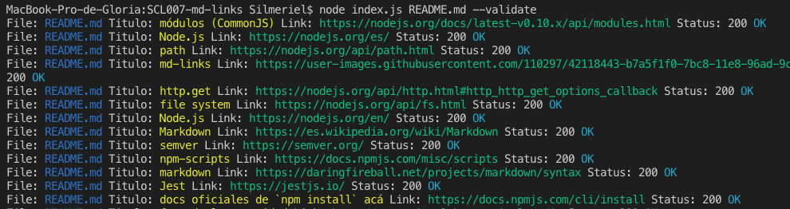

# Markdown Links

Md-Links es un modulo que analiza archivos en formato Markdown.
Sus acciones son:

 * Mostar lista de links.
 * Mostrar ruta del archivo donde se encuentra este el link.
 * Titulo que acompaña a el link.
 * Validar que el link este en funcionamiento o este roto.

## - Pre-Requisitos
Este proyecto necesita tener instalado [Node.js](https://nodejs.org/) en tu computador.

## - Instalación
En la carpeta de tu proyecto debes instalar el siguiente modulo.

 ```
 npm install https://github.com/GloriaMoraga/SCL007-md-links
 ```

## - Guía de uso
Para buscar los links en un archivo .md

 ```
 node <archivo-proyecto.js> <archivo-para-Analizar.md> 
 ```
 Ejemplo:


Para validar los links de el archivo .md


  - `--validate` : estas opciones validan si el link esta activo o no.

 ```
 node <archivo-proyecto.js> <archivo-para-Analizar.md>  --validate
 ```
Ejemplo:


Para mostrar el total del los links en el archivo .md

- `--stats`    : estas opciones muestran estadisticas de los links.

 ```
 node <archivo-proyecto.js> <archivo-para-Analizar.md>  --stats
 ```
Ejemplo:


### - Planificación
Para la planificación se utilizo issues y milestones para revisarla puede hacer click en el siguiente link:.
[MdLinks Markdown Planificación](https://github.com/GloriaMoraga/SCL007-md-links/projects/1)


### - Desarrollado por

**Gloria Moraga Morales**


